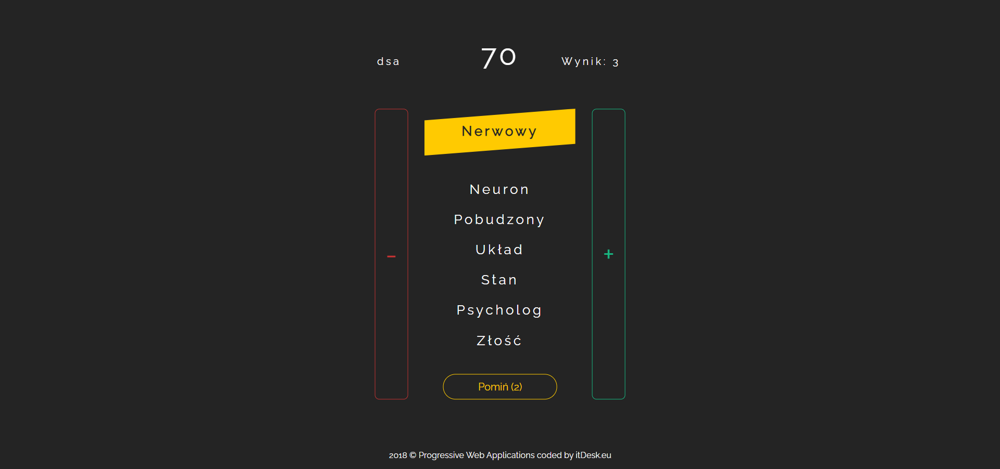

## Zakazane słowa to gra towarzyska polegająca na opisywaniu słowa przez jedną osobę, unikając przy tym słów zakazanych. Druga osoba ma za zadanie odgadnąć opisywane słowo zdobywając tym samym punkty. 
https://zakazane.netlify.app/


## Project setup
```
npm install
```

### Compiles and hot-reloads for development
```
npm run serve
```

### Compiles and minifies for production
```
npm run build
```
